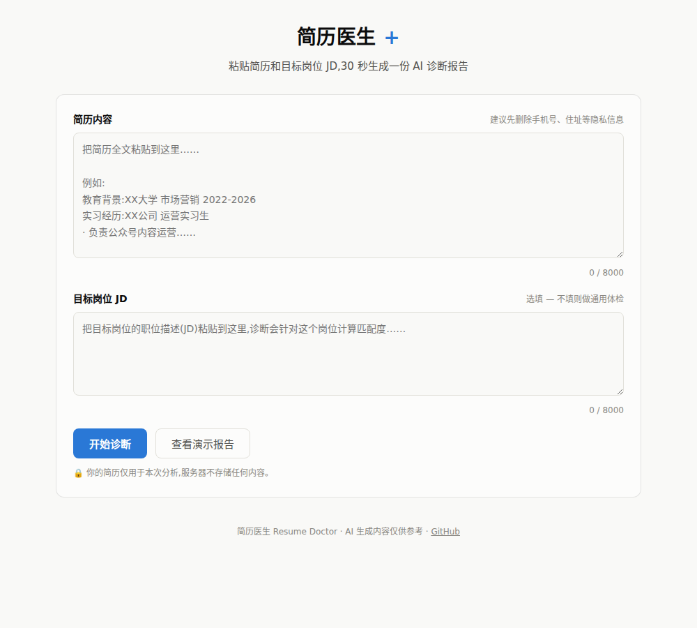
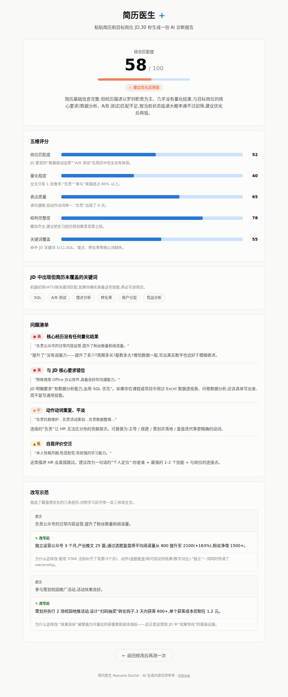

# 简历医生 Resume Doctor

面向求职者的 AI 简历诊断与投递准备工具。用户输入简历和目标岗位 JD，可获得结构化诊断、真实经历约束下的改写、模板化 PDF 导出和模拟面试题。

**在线体验：** [520resume-doctor.online](https://520resume-doctor.online)




## 产品解决的问题

求职者通常知道“简历要优化”，但不知道哪段经历拖累了岗位匹配，也难以针对每一个 JD 快速调整。简历医生把投递前的准备流程拆成可执行的步骤：输入材料、定位问题、改写真实经历、整理版式、预演面试。

本项目是个人作品集中的 AI 求职产品案例，重点展示从需求拆解、AI 交互约束到 Serverless 落地的完整闭环，不把 AI 输出包装成录用结论。

## 当前能力

| 环节 | 已上线能力 | 关键设计 |
| --- | --- | --- |
| 输入 | 粘贴文本、PDF 上传、图片上传识别 | PDF 在浏览器端解析；图片识别需登录后调用服务端模型 |
| 诊断 | 总分、五维评分、问题清单、缺失关键词、改写示范 | 问题必须引用原文，避免无依据的泛化建议 |
| 改写 | 结合 JD 生成完整简历初稿 | 仅改写已有经历；缺少量化数据以 `[X]` 占位，不编造结果 |
| 输出 | 4 套排版模板，一页纸或不限页数 PDF 导出 | 使用浏览器打印引擎导出文字版，便于 ATS 读取 |
| 面试准备 | 生成 6-8 道模拟面试题、考察点与回答思路 | 题目围绕简历与 JD，不以通用题凑数 |
| 访问与统计 | 邮箱验证码登录、聚合用量统计、演示模式 | 统计仅返回聚合数字，不返回简历内容或个人资料 |

## 用户流程

```text
输入简历 + 可选 JD
        ↓
登录后发起真实 AI 请求（未配置服务时仍可查看演示）
        ↓
诊断报告 → 改写初稿 → 选择模板并导出 PDF
        ↓
针对同一材料生成模拟面试题
```

更完整的交互与异常路径见 [用户流程](docs/用户流程.md)。

## AI 设计

- **结构化输出：** 诊断和面试接口请求 JSON 对象，并在服务端做基础校验与兜底清洗，降低前端渲染失败。
- **真实经历约束：** Prompt 明确禁止虚构经历、公司、项目、技能或结果；原文没有的数据以 `[X]` 标识，交由用户补全。
- **可追溯建议：** 诊断问题要求携带简历原句，使用者可以判断建议是否有依据。
- **稳定性与成本：** 简历和 JD 单项均限制 8,000 字；诊断温度设为 `0.3`，减少同一输入的输出漂移。
- **服务端密钥：** 模型 Key 只通过 Vercel 环境变量读取，不写入前端代码。

具体 Prompt、数据边界和运行风险见 [AI 设计说明](docs/AI设计说明.md)。

## 技术架构

```text
浏览器（原生 HTML / CSS / JavaScript）
  ├─ PDF.js：浏览器端提取 PDF 文本
  ├─ 浏览器打印：生成文字版 PDF
  └─ Fetch API
          ↓
Vercel Serverless Functions
  ├─ analyze：结构化简历诊断
  ├─ rewrite：真实经历约束的完整改写
  ├─ interview：模拟面试题
  ├─ extract：图片文字识别
  ├─ auth-*：邮箱验证码与会话
  └─ stats：聚合统计
          ↓
OpenAI 兼容模型接口 + Upstash Redis（可选）
```

## 配置与部署

项目可直接部署到 Vercel。生产环境按需设置：

| 变量 | 用途 |
| --- | --- |
| `DEEPSEEK_API_KEY` | 模型服务 API Key，真实 AI 请求必需 |
| `API_BASE_URL` | 可选，OpenAI 兼容服务地址，默认 DeepSeek |
| `MODEL_NAME` | 可选，默认 `deepseek-chat` |
| `VISION_MODEL` | 可选，图片文字识别使用的多模态模型 |
| `KV_REST_API_URL` / `KV_REST_API_TOKEN` | 可选，验证码、会话和聚合统计使用 |
| `BREVO_API_KEY` / `BREVO_SENDER_EMAIL` | 邮箱验证码发送使用 |

不配置模型 Key 时，演示模式仍可访问；不配置 KV 时，服务端会降级跳过会话校验和统计，适合前端演示，**不应视为生产级访问控制**。部署步骤见 [部署指南](docs/部署指南.md)。

## 项目材料

- [产品需求文档](docs/PRD-产品需求文档.md)：问题、范围、版本与指标
- [AI 设计说明](docs/AI设计说明.md)：Prompt、约束、隐私与风险
- [用户流程](docs/用户流程.md)：主流程、登录和异常处理
- [面试讲解稿](docs/面试讲解稿.md)：作品集陈述与可讨论的取舍

## 边界说明

AI 输出用于辅助用户检查、改写和练习，不保证招聘结果。用户应自行核对内容真实性，避免上传不必要的敏感个人信息。
